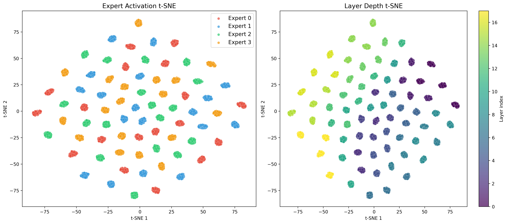

# Custom Models

Build your own architectures using Complexity building blocks.

## Architecture Reference


## Token-Routed Model (Recommended)

```python
from complexity.models import ComplexityModel
from complexity.config import ModelConfig

config = ModelConfig(
    hidden_size=768,
    num_hidden_layers=18,
    num_attention_heads=12,
    num_key_value_heads=4,
    intermediate_size=2048,
    vocab_size=32000,
    mlp_type="token_routed",  # sort-and-split dispatch
    num_experts=4,
    shared_expert=True,
    use_mu_guidance=True,
)
model = ComplexityModel(config)
# 187M params, deterministic routing, no auxiliary losses
```

## Custom Decoder Layer

```python
import torch
import torch.nn as nn
from complexity.core.attention.gqa import GroupedQueryAttention
from complexity.core.mlp import TokenRoutedMLP, MLPConfig
from complexity.models.block import MuGuidance

class MyDecoderLayer(nn.Module):
    def __init__(self, config):
        super().__init__()
        self.input_layernorm = nn.RMSNorm(config.hidden_size)
        self.post_attention_layernorm = nn.RMSNorm(config.hidden_size)

        # GQA Attention with Mu-Guided Q/K/V bias
        self.self_attn = GroupedQueryAttention(config)

        # Token-Routed MLP with shared expert
        mlp_config = MLPConfig(
            hidden_size=config.hidden_size,
            intermediate_size=config.intermediate_size,
            num_experts=4,
            vocab_size=config.vocab_size,
            shared_expert=True,
        )
        self.mlp = TokenRoutedMLP(mlp_config)

        # Mu-Guidance (after MLP, flows to next layer)
        self.mu_guidance = MuGuidance(config.hidden_size)

    def forward(self, x, token_ids=None, mu_prev=None):
        # Attention with mu bias
        residual = x
        x = self.input_layernorm(x)
        x, _ = self.self_attn(x, mu_prev=mu_prev)
        x = residual + x

        # Token-Routed MLP
        residual = x
        x = self.post_attention_layernorm(x)
        x = self.mlp(x, token_ids=token_ids)
        x = residual + x

        # Mu-Guidance (after MLP)
        mu_current = self.mu_guidance(x)

        return x, mu_current
```

## Expert Specialization

Each expert learns different token patterns via deterministic routing:




## Mu-Guidance Flow

Mu carries expert-aware context between layers:


## Registering Custom Components

```python
from complexity.core.registry import register_mlp
from complexity.core.mlp.base import MLPBase

@register_mlp("my_custom_mlp")
class MyCustomMLP(MLPBase):
    def __init__(self, config):
        super().__init__(config)
        # Custom init

    def forward(self, hidden_states, **kwargs):
        # Custom forward
        return output
```

## See Also

- [Token-Routed MLP](token-routed.md)
- [Mu-Guidance](dynamics.md)
- [Architecture Overview](architectures.md)
- [Training](training.md)
