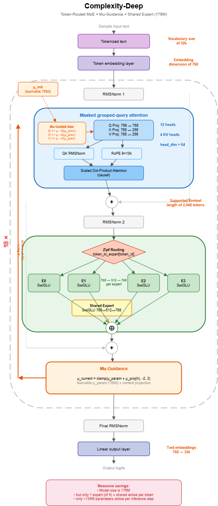
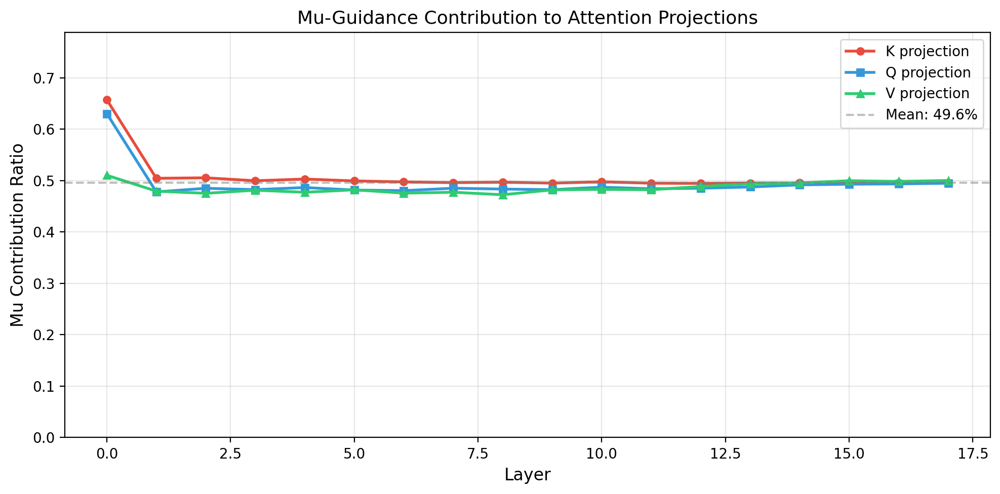
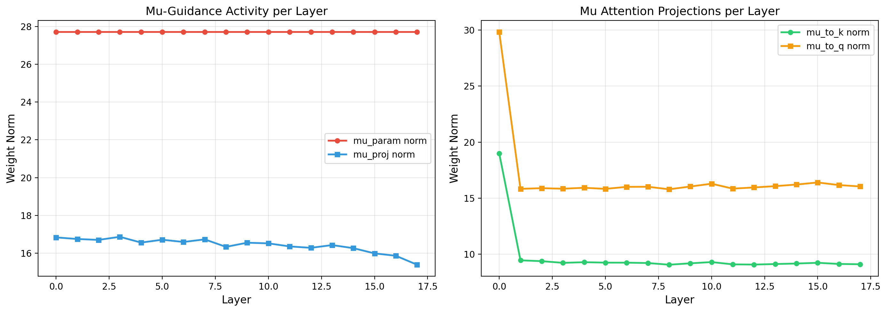

# Mu-Guidance

Inter-layer communication channel for Token-Routed MoE architectures.

## Overview

Mu-Guidance is a learnable signal that flows from layer $l$ to layer $l+1$, carrying expert-aware context. Each layer computes a contextual $\mu$ after its MLP, which influences the next layer's Q/K/V attention projections.

```
Layer l:   Attention → MLP → MuGuidance → mu_current
                                              │
Layer l+1: Attention(mu_prev=mu_current) → MLP → MuGuidance → ...
```



## How It Works

```python
# MuGuidance module (after MLP in each layer)
mu_current = clamp(mu_param + mu_proj(hidden_states), -2.0, 2.0)

# Next layer's attention receives mu_current as mu_prev
q = q_proj(x) + mu_to_q(mu_prev)
k = k_proj(x) + mu_to_k(mu_prev)
v = v_proj(x) + mu_to_v(mu_prev)
```

Key components:
- **mu_param**: learnable vector (768d), initialized to 1.0
- **mu_proj**: linear projection from hidden states
- **clamp(-2, 2)**: prevents feedback explosion between layers
- **mu_init**: learnable parameter for layer 0 (so it also gets guidance)

## Why It Matters



Without Mu-Guidance, the Token-Routed MLP is slightly worse than dense:

| Configuration | Avg Loss (700 steps) |
|---------------|---------------------|
| TR + Mu + Zipf | **5.026** |
| TR sans Mu | 5.127 |
| Dense | 5.205 |

Mu-Guidance is the key component: it tells the next layer which expert processed each token, enabling cross-layer expert coordination.



## Usage

```python
from complexity.models.block import MuGuidance

mu_guidance = MuGuidance(hidden_size=768, mu_min=0.0, mu_max=2.0)
mu_current = mu_guidance(hidden_states)  # [batch, seq, 768]
```

In the training loop (builder.py), the clamp is applied between layers:

```python
mu_prev = model.mu_init.expand(batch_size, seq_len, -1)
for layer in model.layers:
    hidden_states, _, _, mu_contextual = layer(hidden_states, mu_prev=mu_prev)
    mu_prev = torch.clamp(mu_contextual, -2.0, 2.0)
```

## vLLM Integration

Mu-Guidance is fully supported in vLLM inference:
- `mu_init` stored outside `torch.compile` scope
- `mu_prev` flows through all 18 layers with clamp(-2, 2)
- Compatible with PagedAttention and CUDA graphs

## See Also

- [Token-Routed MLP](token-routed.md)
- [Architecture Overview](architectures.md)
- [Training](training.md)
