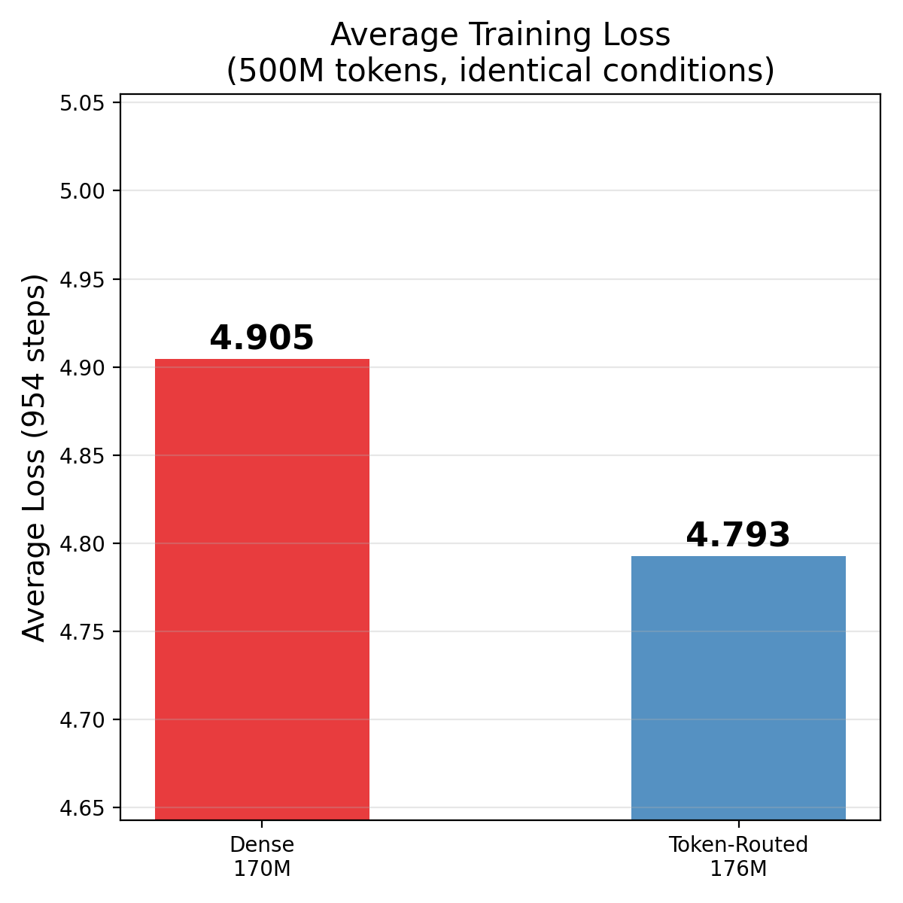

# Efficient Training

Optimizations for training on limited hardware.

## GPU Requirements

| VRAM | Model | Batch | Optimizations |
|------|-------|-------|---------------|
| 96 GB (RTX 6000) | 187M | 128 | bf16, 2 GPUs |
| 48 GB (A6000) | 187M | 64 | bf16 |
| 24 GB (4090) | 187M | 16 | bf16, gradient checkpointing |
| 16 GB (4080/5060Ti) | 187M | 8 | bf16, checkpointing, accumulation |

## Training Results


Our 187M model trained on 500M tokens with 2x RTX 6000 (96GB each):

| Metric | Value |
|--------|-------|
| Steps | 954 |
| Time | ~83 min |
| Avg Loss | 4.793 (full model) |
| Throughput | ~100k tokens/step |

## Inference



Deployed on vLLM: **204 tokens/s** on a single RTX 5060 Ti (16GB).

## Gradient Checkpointing

Reduces VRAM at ~30% speed cost:

```python
model.gradient_checkpointing_enable()
```

## Mixed Precision (bf16)

```python
with torch.autocast("cuda", dtype=torch.bfloat16):
    loss = model(input_ids)
loss.backward()
```

## Gradient Accumulation

Simulate larger batch on small GPUs:

```bash
# Effective batch = batch_size * gradient_accumulation * num_gpus
python scripts/train_ablation_150m.py --run 2 --batch-size 16 --gradient-accumulation 8
```

## Multi-GPU (FSDP)

```bash
torchrun --nproc_per_node=2 scripts/train_ablation_150m.py -- --run 2 --batch-size 128
```

## See Also

- [Training Guide](training.md)
- [CUDA Optimizations](cuda.md)
