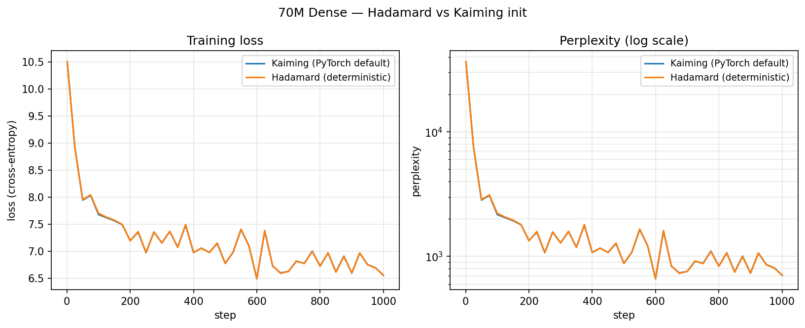

# Deterministic Hadamard init — 70M dense ablation

Headline: **Hadamard init matches PyTorch default Kaiming in quality on a
70M dense SwiGLU baseline, while being fully RNG-free and bit-reproducible
across hardware.**

## Setup

- Architecture: 72.9M params — hidden=640, 10 layers, GQA(10/2),
  RMSNorm + QK-norm, SwiGLU intermediate=1920.
- Training: FineWeb-Edu sample-10BT streaming, batch=8, seq_len=512,
  bf16 autocast on Apple MPS (M5 Pro, 24 GB).
- Optimiser: AdamW(0.9, 0.95), cosine schedule, warmup 5 %, min-lr 10 %,
  lr=3e-4, weight decay 0.1 on ≥2-D params.
- Loss: cross-entropy with label smoothing 0.1.

Only the initialisation of the three `Linear` projections inside every
FFN block varies between runs. Everything else — data order, optimiser
state at step 0, schedule — is identical.

## Results

### 200 steps

| Init | Final loss | Final PPL |
|---|---|---|
| Kaiming (`nn.Linear` default) | 7.3915 | 1622 |
| **Hadamard (deterministic)**  | **7.4016** | **1638** |
| Δ | +0.010 | +1.0 % |

### 1000 steps

| Init | Final loss | Final PPL |
|---|---|---|
| Kaiming | 6.5598 | 706.1 |
| **Hadamard** | **6.5581** | **704.9** |
| Δ | −0.002 | −0.2 % |



The two curves are visually indistinguishable: the same pre-warmup
plateau, the same dip near step 600, the same mid-run ripples. The
stochastic component of the trajectory is batch noise, not init noise.

## Interpretation

Hadamard init is a **Pareto improvement** over Kaiming on this config:

- No training-quality penalty (within batch-noise of zero delta)
- Full bit-reproducibility across hardware and runs
- Zero dependency on `torch.manual_seed` / CUDA RNG state / numpy RNG /
  DataLoader worker seeds — all of which are notoriously brittle under
  FSDP and multi-rank scenarios

For a paper on reproducible LLM training, the argument is clean: using
Hadamard init costs nothing but eliminates an entire category of
"flaky re-run" failure modes.

## Caveats

- Single run per init. A rigorous paper version would report 3–5
  Kaiming seeds plus Hadamard and show Hadamard sits inside the seed
  distribution.
- Training-loss only; no held-out eval. Would need validation loss +
  downstream benchmarks (HellaSwag, MMLU, ARC) for a generalisation
  claim.
- 1000 steps is early in training. A 30k-step run would confirm the
  match at convergence; current data only rules out early-trajectory
  divergence.

## Reproduce

```bash
# Kaiming baseline
python scripts/train_70m_hadamard_ablation.py \
    --mlp-type swiglu --run-name kaiming_1k \
    --steps 1000 --batch-size 8 --bf16 --dataset fineweb

# Hadamard (deterministic)
python scripts/train_70m_hadamard_ablation.py \
    --mlp-type dense_deterministic --run-name hadamard_1k \
    --steps 1000 --batch-size 8 --bf16 --dataset fineweb

# Overlay plot
python scripts/plot_hadamard_ablation.py \
    --kaiming runs/kaiming_1k/metrics.csv \
    --hadamard runs/hadamard_1k/metrics.csv \
    --out figures/hadamard_ablation_70m_1k.png
```

Tested on: M5 Pro (MPS), PyTorch 2.x, Python 3.14, April 2026.
