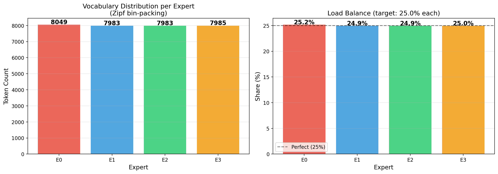
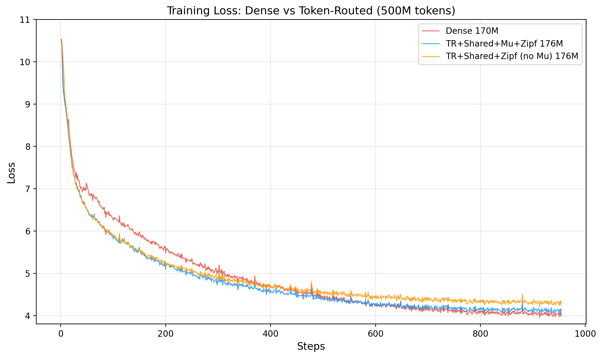

# Token-Routed MLP

Deterministic MoE with sort-and-split dispatch. Zero routing overhead, perfect load balancing.

## Architecture


## How It Works

Each token is assigned to an expert deterministically via its token ID:

```python
expert_id = token_to_expert[token_id]  # Zipf-balanced lookup table
```

Tokens are then sorted by expert assignment and processed in fixed-size chunks via batched matmul (bmm). No dynamic shapes, fullgraph compatible with `torch.compile`.

### Sort-and-Split Dispatch

```
1. Route:   expert_ids = token_to_expert[token_ids]
2. Sort:    sort_idx = expert_ids.argsort(stable=True)
3. Split:   chunk = N // num_experts  (fixed size)
4. BMM:     each expert processes its N/E chunk
5. Unsort:  output[sort_idx] = sorted_output
```

Each expert processes exactly N/4 tokens. No wasted compute, no idle experts.

### Zipf-Balanced Routing

Simple modulo routing (`token_id % 4`) concentrates frequent tokens on low-ID experts. Zipf-balanced routing fixes this via greedy bin-packing:

1. Sort tokens by corpus frequency (descending)
2. Assign each token to the least-loaded expert
3. Result: each expert handles equal frequency mass



### Shared Lexical Expert

A dense SwiGLU MLP that all tokens pass through, capturing common patterns (function words, syntax). Output = shared(x) + routed(x).

## Comparison with Learned MoE (Mixtral)

| Aspect | Mixtral (learned) | Token-Routed (ours) |
|--------|-------------------|---------------------|
| Router | nn.Linear + softmax | **None** |
| Load balancing | Auxiliary loss required | **Perfect by design** |
| Expert collapse | Possible | **Impossible** |
| Routing overhead | Forward pass through router | **Table lookup** |
| Deterministic | No | **Yes** |
| CUDA graph safe | Requires splitting_ops | **Fully compatible** |

### Training Results (500M tokens, iso-param ~187M)

| Run | Avg Loss | Description |
|-----|----------|-------------|
| Run 2: TR + Mu + Zipf | **5.026** | Full architecture |
| Run 4: Mixtral (learned) | 5.110 | Learned router baseline |
| Run 3: TR sans Mu | 5.127 | Ablation without Mu-Guidance |
| Run 1: Dense | 5.205 | Dense SwiGLU baseline |

*Averaged over first 700 steps. Token-Routed converges faster because experts specialize immediately without learning a router.*



## Usage

```python
from complexity.core.mlp import TokenRoutedMLP, MLPConfig

config = MLPConfig(
    hidden_size=768,
    intermediate_size=2048,
    num_experts=4,
    vocab_size=32000,
    shared_expert=True,
    token_frequencies=freqs,  # enables Zipf-balanced routing
)
mlp = TokenRoutedMLP(config)
output = mlp(hidden_states, token_ids=input_ids)
```

## vLLM Inference

The model is deployed on vLLM with PagedAttention and CUDA graphs, achieving **204 tokens/s** on a single RTX 5060 Ti (16GB) with a 2,040-token context.

## See Also

- [Mu-Guidance](dynamics.md)
- [Architecture Overview](architectures.md)
- [Training](training.md)
