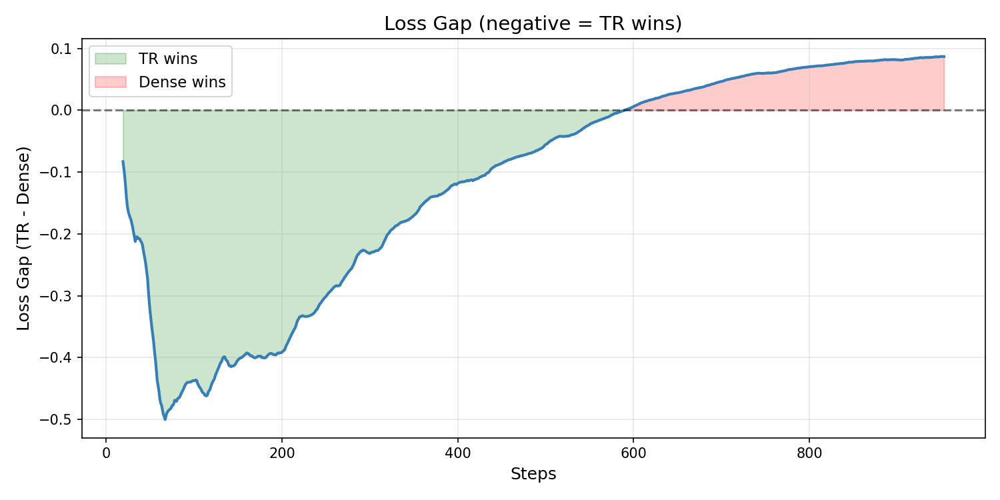
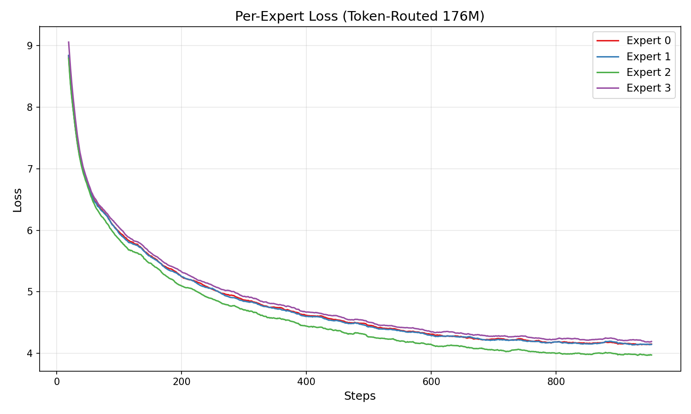
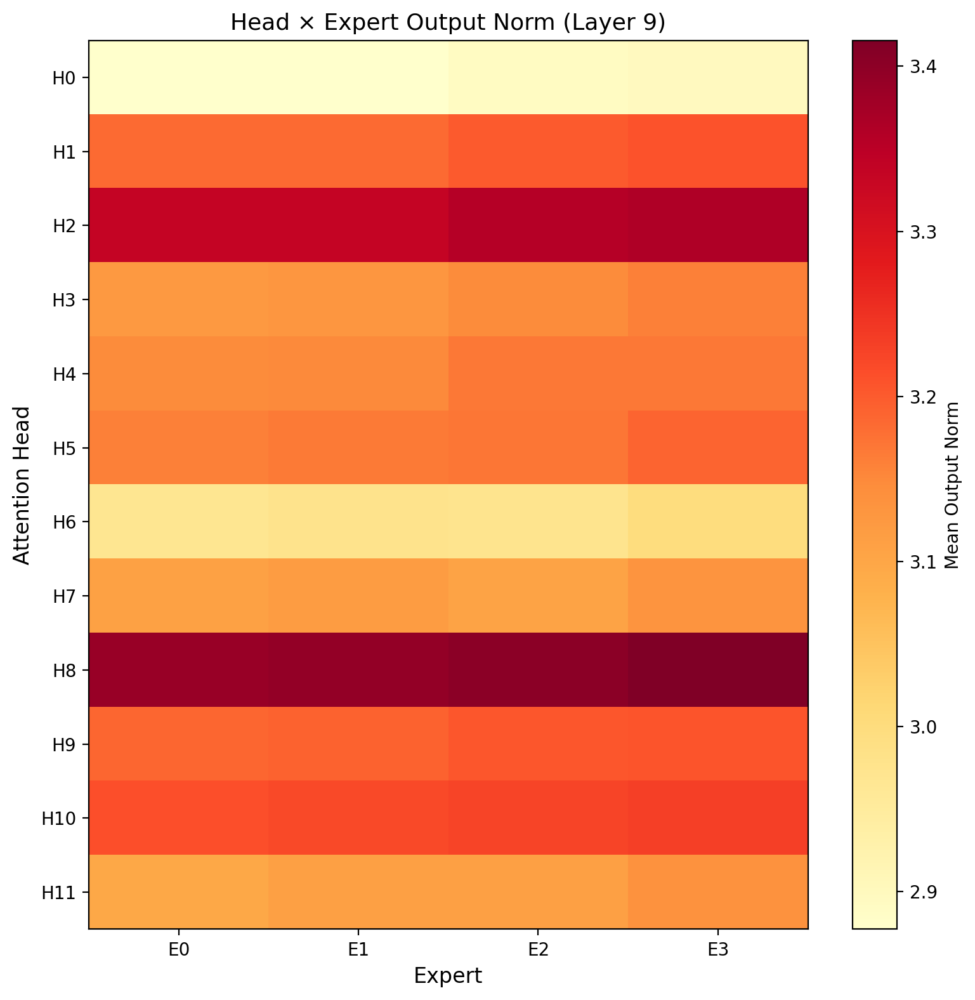

# Training

Guide for training Complexity-Deep models.

## Quick Start

```bash
# Single GPU
python scripts/train_ablation_150m.py --run 2 --batch-size 128 --target-tokens 500000000

# Multi-GPU (2x RTX 6000)
torchrun --nproc_per_node=2 scripts/train_ablation_150m.py -- --run 2 --batch-size 128 --target-tokens 500000000
```

## Training Runs

| Run | Description | Params | Avg Loss |
|-----|-------------|--------|----------|
| 1 | Dense SwiGLU baseline | 171M | 5.205 |
| 2 | **Full Complexity** (TR + Mu + Zipf + Shared) | 187M | **5.026** |
| 3 | TR without Mu-Guidance | 187M | 5.127 |
| 4 | Mixtral baseline (learned router) | 187M | 5.110 |

*700-step averages on 500M tokens FineWeb-Edu.*


## Loss Gap: Dense vs Token-Routed



The Token-Routed model leads over 95% of training (green area).

## Average Training Loss


## Hyperparameters

| Parameter | Value |
|-----------|-------|
| Learning rate | 3e-4 (auto-scaled by batch size) |
| Warmup | 5% of total steps (auto) |
| Scheduler | Cosine decay |
| Optimizer | AdamW (FSDP) or Muon |
| Precision | bf16 |
| Batch size | 64 per GPU |

## Expert Analysis





## Inference

Deployed on vLLM: **204 tokens/s** on RTX 5060 Ti (16GB).

## See Also

- [Token-Routed MLP](token-routed.md)
- [Mu-Guidance](dynamics.md)
